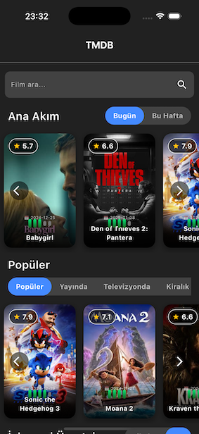
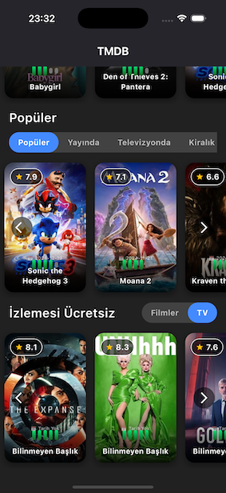
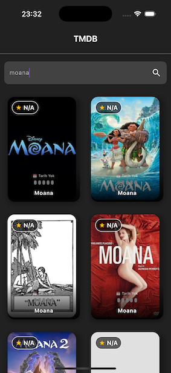

# 🎬 Movie Finder

Movie Finder, TMDB (The Movie Database) API kullanarak popüler, trend olan, sinemalarda, yayında, televizyonda ve ücretsiz izlenebilen filmleri keşfetmenizi sağlayan bir mobil uygulamadır. Uygulama **Flutter ve Riverpod** kullanılarak geliştirilmiştir ve **Clean Architecture** prensiplerine uygun olarak yapılandırılmıştır.

---

## 🌟 Özellikler

✅ **Film Arama** – Kullanıcıların TMDB veritabanından film aramasını sağlar.\
✅ **Popüler Filmler** – Güncel popüler filmleri gösterir.\
✅ **Trend Olan Filmler** – Günlük ve haftalık trend olan filmleri listeler.\
✅ **Sinemalarda Olan Filmler** – Şu an sinemalarda gösterimde olan filmleri sunar.\
✅ **Yayında (Streaming) Olan Filmler** – Dijital platformlarda yayında olan filmleri gösterir.\
✅ **Televizyonda Yayınlanan Filmler** – TV’de gösterimde olan filmleri sunar.\
✅ **Ücretsiz İzlenebilir Filmler** – Kullanıcılara ücretsiz izlenebilir filmler sunar.\
✅ **Riverpod ile State Management** – Tüm veri yönetimi ve API istekleri Riverpod ile yönetilmektedir.\
✅ **Flutter Widget Optimizasyonu** – Responsive tasarım ve performans optimizasyonları içerir.\
✅ **Clean Architecture Kullanımı** – Veriyi yönetmek için katmanlı mimari kullanılmıştır.

---

## 📂 Proje Yapısı

```
lib/
│── core/
│   ├── constants/
│   │   ├── api_constants.dart
│   │   ├── color_constants.dart
│   │   ├── constants.dart
│   │   ├── text_styles.dart
│   ├── network/
│   │   ├── api_client.dart
│   │   ├── api_service.dart
│
│── data/
│   ├── models/
│   │   ├── movie.dart
│   │   ├── movie.freezed.dart
│   │   ├── movie.g.dart
│   ├── repositories/
│   │   ├── movie_repository.dart
│
│── domain/
│   ├── entities/
│   │   ├── movie_entity.dart
│   ├── usecases/
│   │   ├── search_movies_usecase.dart
│
│── presentation/
│   ├── providers/
│   │   ├── movie_provider.dart
│   ├── views/
│   │   ├── search_screen.dart
│   ├── widgets/
│   │   ├── custom_toggle_buttons.dart
│   │   ├── movie_card.dart
│   │   ├── movie_section.dart
│   │   ├── navigation_buttons.dart
│   │   ├── search_bar.dart
│
│── main.dart
```

---

## 📌 Kullanılan Teknolojiler ve Kütüphaneler

| Teknoloji / Kütüphane          | Açıklama                                             |
| ------------------------------ | ---------------------------------------------------- |
| **Flutter**                    | UI geliştirmek için kullanılan framework             |
| **Riverpod**                   | State management için kullanılan reaktif kütüphane   |
| **Dio**                        | HTTP istekleri için kullanılan kütüphane             |
| **CachedNetworkImage**         | Görselleri önbelleğe almak için kullanılan kütüphane |
| **Freezed & JsonSerializable** | Model yönetimi ve JSON dönüşümleri için kullanılır   |
| **Flutter Dotenv**             | Çevresel değişkenleri yönetmek için kullanılır       |

---

## 🏗 **Mimari Yapı (Clean Architecture)**

Bu proje **Clean Architecture** prensiplerine uygun olarak yapılandırılmıştır. **Data, Domain ve Presentation** katmanları kullanılmıştır:

- **Data Katmanı:** API’den gelen verileri işler, modelleri ve repository sınıflarını içerir.
- **Domain Katmanı:** İş mantığını yöneten **UseCase** ve **Entity** sınıflarını içerir.
- **Presentation Katmanı:** UI bileşenlerini içerir (Widgets, Providers, Screens).

---

## 📥 **Kurulum ve Çalıştırma**

### 1️⃣ **Gereksinimler**

- Flutter **3.x.x** sürümü yüklü olmalıdır.
- Bir TMDB API anahtarınız olmalıdır.

### 2️⃣ **Projeyi Klonlayın**

```sh
git clone https://github.com/Aylinbaykan/movie_finder.git
cd movie_finder
```

### 3️⃣ **Gerekli Bağımlılıkları Yükleyin**

```sh
flutter pub get
```

### 4️⃣ **API Anahtarını Tanımlayın**

Projede API anahtarı `.env` dosyasında saklanmaktadır. **Test sürecini kolaylaştırmak için .env dosyası şu an gizlenmemiştir.**

📌 **.env** dosyanızı proje dizinine ekleyin:

```
API_KEY=your_tmdb_api_key
BASE_URL=https://api.themoviedb.org/3
IMAGE_BASE_URL=https://image.tmdb.org/t/p/w500
```

📌 **main.dart içinde dotenv yüklemeyi unutmayın:**

```dart
import 'package:flutter_dotenv/flutter_dotenv.dart';
await dotenv.load(fileName: ".env");
```

### 5️⃣ **Uygulamayı Çalıştırın**

```sh
flutter run
```

---

## 📸 **Ekran Görüntüleri**

| Ana Sayfa 1 | Ana Sayfa 2 | Arama Sonuçları |
| ----------- | ----------- | --------------- |
| 🎬  | 🎬  | 🔍  |

---

## 🚀 **Öne Çıkan Özellikler**

### 🎯 **Responsive UI Tasarımı**

Tasarım tüm cihazlarda sorunsuz çalışacak şekilde responsive olarak geliştirilmiştir. **MediaQuery** ve **Flexible Widgets** kullanılarak ekran boyutuna göre dinamik bir görünüm sağlanmıştır.

### 🎯 **Riverpod ile API Yönetimi**

Tüm API çağrıları **FutureProvider** ile yapılır. Örnek kullanım:

```dart
final popularMoviesProvider = FutureProvider<List<Movie>>(
  (ref) async => ref.read(movieRepositoryProvider).getPopularMovies(),
);
```

### 📊 **CachedNetworkImage ile Görsel Optimizasyonu**

Afiş ve poster görselleri **önbelleğe** alınarak daha hızlı yükleme sağlanır:

```dart
CachedNetworkImage(
  imageUrl: '${ApiConstants.imageBaseUrl}/${movie.posterPath}',
  placeholder: (context, url) => CircularProgressIndicator(),
  errorWidget: (context, url, error) => Icon(Icons.broken_image),
);
```

### 🌟 **Movie Card Tasarımı**

Filmler **estetik bir kart tasarımı** ile gösterilir.

```dart
class MovieCard extends StatelessWidget {
  final Movie movie;
  Widget build(BuildContext context) {
    return GestureDetector(
      child: Stack(
        children: [
          CachedNetworkImage(imageUrl: movie.posterPath!),
          Positioned(child: Text(movie.originalTitle!)),
        ],
      ),
    );
  }
}
```

# movie_finder
